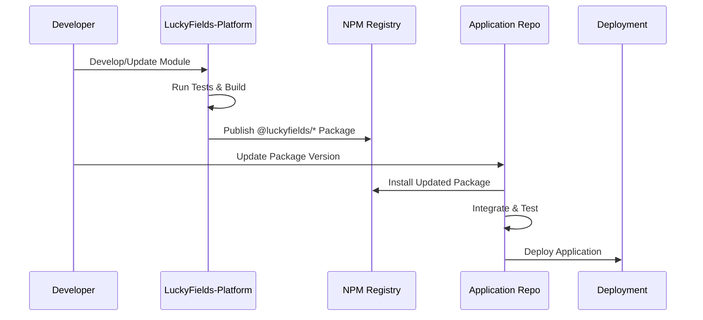
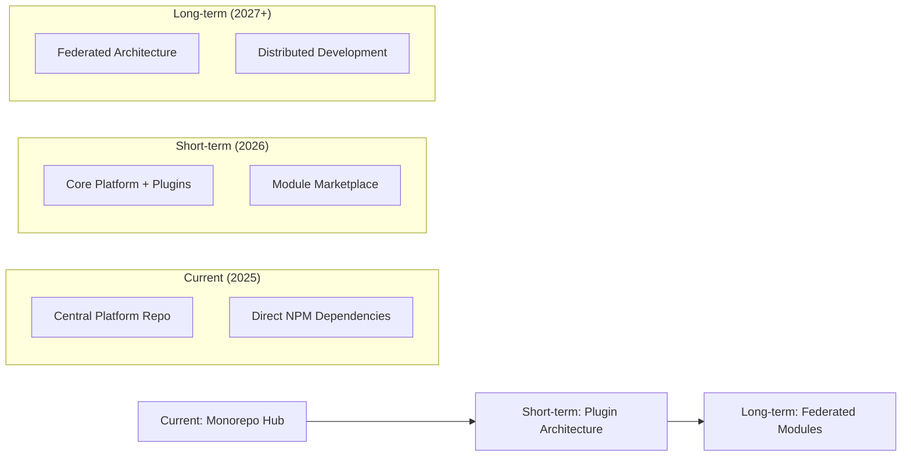

# LuckyFields Repository Map

## Overview

This document provides a visual and structural map of the LuckyFields ecosystem, showing how the LuckyFields-Platform serves as the central infrastructure for all LuckyFields.LLC applications. This map helps developers, AI agents, and stakeholders understand the relationships and dependencies across the ecosystem.

The architecture follows a hub-and-spoke model with LuckyFields-Platform as the central hub providing shared functionality to all application repositories.

## Ecosystem Architecture

### High-Level Relationship Diagram

```mermaid
graph TD
    Platform[LuckyFields-Platform<br/>TypeScript Monorepo]
    
    subgraph "Applications"
        Kids[kids-daily-quiz<br/>Educational Platform]
        Minsei[minsei-app<br/>Wellness Application]
        Sekiken[sekikenzai-system<br/>Construction Management]
        Future[Future Applications<br/>...]
    end
    
    subgraph "Infrastructure Modules"
        Blobs[blobs-utils<br/>File Storage]
        Functions[functions-utils<br/>Serverless Helpers]
        API[api-utils<br/>HTTP Clients]
        Config[config-utils<br/>Configuration]
    end
    
    subgraph "AI & Analytics Modules"
        AI[ai-utils<br/>LLM Integration]
        Notebook[notebook-utils<br/>Data Analysis]
        Diagnostics[diagnostics<br/>Monitoring]
    end
    
    subgraph "Frontend Modules"
        Hooks[hooks<br/>React Hooks]
        UI[ui-components<br/>Design System]
    end
    
    Platform --> Blobs
    Platform --> Functions
    Platform --> API
    Platform --> Config
    Platform --> AI
    Platform --> Notebook
    Platform --> Diagnostics
    Platform --> Hooks
    Platform --> UI
    
    Blobs -.-> Kids
    Functions -.-> Kids
    API -.-> Kids
    Config -.-> Kids
    AI -.-> Kids
    Hooks -.-> Kids
    UI -.-> Kids
    
    Blobs -.-> Minsei
    Functions -.-> Minsei
    API -.-> Minsei
    Config -.-> Minsei
    Diagnostics -.-> Minsei
    Hooks -.-> Minsei
    UI -.-> Minsei
    
    Blobs -.-> Sekiken
    Functions -.-> Sekiken
    API -.-> Sekiken
    Config -.-> Sekiken
    Notebook -.-> Sekiken
    Diagnostics -.-> Sekiken
    UI -.-> Sekiken
    
    Blobs -.-> Future
    Functions -.-> Future
    API -.-> Future
    Config -.-> Future
    AI -.-> Future
    Hooks -.-> Future
    UI -.-> Future
```



### Repository Structure Map

```
LuckyFields Ecosystem
├── 🏗️ LuckyFields-Platform (Core Infrastructure)
│   ├── apps/
│   │   └── lab/                  # LuckyFields.Lab Portal Site (NEW)
│   ├── packages/
│   │   ├── blobs-utils/           # File storage & management
│   │   ├── functions-utils/       # Serverless function helpers
│   │   ├── api-utils/            # HTTP clients & API patterns
│   │   ├── config-utils/         # Configuration management
│   │   ├── env-core/             # Environment & Schema core
│   │   ├── repo-health/          # Repository health monitoring
│   │   ├── ai-utils/             # AI & LLM integration
│   │   ├── notebook-utils/       # Jupyter & data analysis
│   │   ├── diagnostics/          # Monitoring & error tracking
│   │   ├── hooks/                # React hooks & state
│   │   └── ui-components/        # Design system & components
│   ├── data/                     # Source of Truth (JSON data)
│   ├── docs/                     # Platform & Design Documentation
│   ├── tools/                    # Build & development tools
│   └── netlify/                  # Serverless Functions
│   └── examples/                 # Usage examples
│
├── 🎓 kids-daily-quiz (Project - External)
│   ├── src/
│   ├── components/               # App-specific components
│   ├── pages/                    # Quiz & learning pages
│   ├── utils/                    # App-specific utilities
│   └── package.json              # Depends on @luckyfields/* modules
│
├── 🧘 minsei-app (Wellness Application)
│   ├── src/
│   ├── components/               # Wellness UI components
│   ├── features/                 # Wellness features
│   ├── services/                 # App-specific services
│   └── package.json              # Depends on @luckyfields/* modules
│
├── 🏗️ sekikenzai-system (Construction Management)
│   ├── src/
│   ├── modules/                  # Business logic modules
│   ├── reports/                  # Report generation
│   ├── data/                     # Data management
│   └── package.json              # Depends on @luckyfields/* modules
│
└── 🚀 future-applications
    └── [Additional applications following the same pattern]
```

## Dependency Flow

### Module Usage Matrix

| Application | blobs | functions | api | config | ai | notebook | diagnostics | hooks | ui |
|-------------|-------|-----------|-----|--------|----|---------|-----------|---------|----|
| kids-daily-quiz | ✅ | ✅ | ✅ | ✅ | ✅ | ❌ | ✅ | ✅ | ✅ |
| minsei-app | ✅ | ✅ | ✅ | ✅ | ❌ | ❌ | ✅ | ✅ | ✅ |
| sekikenzai-system | ✅ | ✅ | ✅ | ✅ | ❌ | ✅ | ✅ | ❌ | ✅ |
| future-apps | 🔄 | 🔄 | 🔄 | 🔄 | 🔄 | 🔄 | 🔄 | 🔄 | 🔄 |

**Legend:**

- ✅ Currently using
- ❌ Not using
- 🔄 Planned/Variable

### Data Flow Architecture

```
┌─────────────────────────────────────────────────────────────┐
│                    LuckyFields-Platform                     │
│                   (Development & Publishing)                │
└─────────────────────────────────────────────────────────────┘
                               │
                               │ npm publish
                               ▼
┌─────────────────────────────────────────────────────────────┐
│                       NPM Registry                         │
│                  @luckyfields/* packages                   │
└─────────────────────────────────────────────────────────────┘
                               │
                               │ npm install
                               ▼
┌─────────────────────────────────────────────────────────────┐
│                  Application Repositories                  │
│              (kids-daily-quiz, minsei-app, etc.)          │
└─────────────────────────────────────────────────────────────┘
```

## Deployment Architecture

### Development Flow



### Versioning Strategy

```
LuckyFields-Platform (Source)
├── v1.0.0 → @luckyfields/api-utils@1.0.0
├── v1.1.0 → @luckyfields/api-utils@1.1.0
└── v2.0.0 → @luckyfields/api-utils@2.0.0
                            │
                            ▼
Application package.json
{
  "dependencies": {
    "@luckyfields/api-utils": "^1.1.0",
    "@luckyfields/ui-components": "^2.0.0"
  }
}
```

## Integration Patterns

### Module Integration Example

```typescript
// In kids-daily-quiz application
import { ApiClient } from '@luckyfields/api-utils';
import { Button, Card } from '@luckyfields/ui-components';
import { useApiData } from '@luckyfields/hooks';
import { trackEvent } from '@luckyfields/diagnostics';

// Application-specific implementation using platform modules
const QuizComponent = () => {
  const { data, loading } = useApiData('/api/quiz-questions');
  
  const handleAnswer = (answer: string) => {
    trackEvent('quiz_answer_submitted', { answer });
    // App-specific logic
  };
  
  return (
    <Card>
      <Button onClick={() => handleAnswer('A')}>
        Answer A
      </Button>
    </Card>
  );
};
```

### Common Integration Scenarios

1. **API Integration**: Using `@luckyfields/api-utils` + `@luckyfields/hooks`
2. **File Management**: Using `@luckyfields/blobs-utils` + `@luckyfields/functions-utils`
3. **UI Development**: Using `@luckyfields/ui-components` + `@luckyfields/hooks`
4. **Analytics**: Using `@luckyfields/diagnostics` across all touchpoints
5. **Configuration**: Using `@luckyfields/config-utils` for environment management

## Repository Relationships

### Ownership & Responsibility

| Repository | Owner | Primary Purpose | Deployment |
|------------|-------|----------------|------------|
| LuckyFields-Platform | Platform Team | Shared infrastructure | NPM Registry |
| kids-daily-quiz | Education Team | Children's learning platform | Netlify |
| minsei-app | Wellness Team | Personal wellness application | Vercel |
| sekikenzai-system | Construction Team | Material management system | Custom AWS |

### Communication Channels

```
Platform Updates
├── Release Notes → All application teams
├── Breaking Changes → Direct team communication
├── Security Updates → Immediate notification
└── Feature Requests → Platform team review

Application Feedback
├── Bug Reports → Platform team issue tracker
├── Feature Requests → Platform roadmap input
├── Performance Issues → Platform optimization backlog
└── Usage Analytics → Platform team insights
```

## Scaling Considerations

### Current Scale

- **Modules**: 9 active modules
- **Applications**: 3 active applications
- **Teams**: 4 development teams
- **Deployments**: Multiple platforms (Netlify, Vercel, AWS)

### Growth Projections

```
Year 1 (2025): 9 modules → 15 modules, 3 apps → 6 apps
Year 2 (2026): 15 modules → 25 modules, 6 apps → 12 apps
Year 3 (2027): 25 modules → 40 modules, 12 apps → 20 apps
```

### Architectural Evolution



## Monitoring & Analytics

### Repository Health Metrics

| Metric | Platform | Applications |
|--------|----------|-------------|
| Build Success Rate | >99% | >95% |
| Test Coverage | >90% | >80% |
| Security Vulnerabilities | 0 critical | 0 critical |
| Dependency Health | Green | Green |
| Documentation Coverage | 100% | >90% |

### Usage Analytics Flow

```
Application Usage
├── @luckyfields/diagnostics → Platform Analytics
├── Performance Metrics → Platform Optimization
├── Error Tracking → Platform Bug Fixes
└── Feature Usage → Platform Roadmap
```

---

*Last updated: 2025-10-09*
